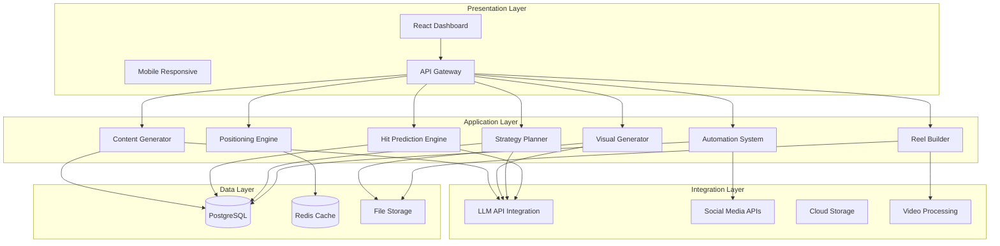

# Design Document: GrowMate AI – Digital Marketing Co-Pilot

## Overview

GrowMate AI is an intelligent digital marketing co-pilot designed specifically for the Indian market, transforming unstructured social media posting into data-driven digital growth. The system integrates AI-powered content creation, visual design, strategic planning, engagement prediction, and automated scheduling into a unified platform with comprehensive multilingual support.

### Core Value Proposition
- **For Small Businesses**: Democratizes professional marketing capabilities through AI assistance
- **For Creators**: Provides data-backed insights to optimize content performance  
- **For Marketing Beginners**: Offers guided workflows from strategy to publication
- **For Regional Businesses**: Delivers multilingual content with cultural authenticity

### Design Philosophy
1. **Human-Centric AI**: AI works behind the scenes—output feels authentically human
2. **Data-Driven Decisions**: Every recommendation backed by analytics and predictions
3. **Progressive Disclosure**: Simple interfaces for beginners, advanced options for experts
4. **Cultural Intelligence**: Built-in understanding of Indian market nuances
5. **Practical Innovation**: Balances cutting-edge AI with implementation feasibility

## Architecture

### High-Level System Architecture



### Component Architecture Principles

1. **Microservices-inspired**: Loosely coupled components with clear interfaces
2. **Event-Driven**: Components communicate through message queues for scalability
3. **CQRS Pattern**: Separate read and write models for performance optimization
4. **Caching Strategy**: Multi-layer caching (Redis, CDN, browser) for frequent operations
5. **Async Processing**: Long-running tasks (video rendering, batch generation) handled asynchronously

### Deployment Architecture

```
┌─────────────────────────────────────────────────────────────┐
│                    Cloud Infrastructure                      │
├─────────────┬──────────────┬──────────────┬─────────────────┤
│  Frontend   │   Backend    │   Workers    │    Database     │
│  (CDN)      │  (Containers)│  (Queues)    │   (Managed)     │
├─────────────┼──────────────┼──────────────┼─────────────────┤
│ • React App │ • FastAPI    │ • Video      │ • PostgreSQL    │
│ • Tailwind  │ • Python     │   Processing │ • Redis Cache   │
│ • Static    │ • Async      │ • Batch      │ • Object Storage│
│   Assets    │   Workers    │   Jobs       │                 │
└─────────────┴──────────────┴──────────────┴─────────────────┘
```

## Components and Interfaces

### 1. Content Generator Component

**Purpose**: Generate platform-optimized marketing content with contextual awareness

**Interface**:
```python
class ContentGenerator:
    def generate_post(
        self,
        business_type: BusinessType,
        target_audience: AudienceProfile,
        platform: SocialPlatform,
        goal: MarketingGoal,
        language: Language = Language.ENGLISH,
        brand_voice: Optional[BrandVoice] = None
    ) -> GeneratedContent:
        """
        Generate complete marketing post with hook, caption, CTA, and hashtags
        Returns 3 variations for A/B testing
        """
    
    def generate_content_batch(
        self,
        strategy: MarketingStrategy,
        count: int,
        language: Language
    ) -> List[GeneratedContent]:
        """
        Generate multiple posts aligned with marketing strategy
        """
```

**Key Algorithms**:
- **Platform-specific templates**: Different prompt engineering for Instagram, LinkedIn, X
- **Brand voice preservation**: Context window management for consistent tone
- **Cultural adaptation**: Region-specific references and colloquial expressions
- **Variation generation**: Creative divergence while maintaining core message

### 2. Hit Prediction Engine Component

**Purpose**: Analyze and score post effectiveness using multi-factor analysis

**Interface**:
```python
class HitPredictionEngine:
    def analyze_post(self, post: GeneratedContent) -> PostAnalysis:
        """
        Perform multi-dimensional analysis of post content
        Returns scores for hook strength, CTA clarity, etc.
        """
    
    def calculate_hit_score(self, analysis: PostAnalysis) -> HitScore:
        """
        Calculate composite score (0-100) using weighted factors
        """
    
    def get_improvement_suggestions(
        self, 
        post: GeneratedContent, 
        score: HitScore
    ) -> List[ImprovementSuggestion]:
        """
        Generate specific, actionable suggestions for low-scoring posts
        """
```

**Scoring Model**:
```
Hit Score = 
  Hook Strength (30%) × 0.3 +
  CTA Clarity (25%) × 0.25 + 
  Platform Optimization (20%) × 0.2 +
  Hashtag Quality (15%) × 0.15 +
  Emotional Resonance (10%) × 0.1
```

### 3. Positioning Engine Component

**Purpose**: Recommend optimal platforms, timing, and content formats

**Interface**:
```python
class PositioningEngine:
    def recommend_platforms(
        self,
        content: GeneratedContent,
        audience: AudienceProfile
    ) -> PlatformRecommendation:
        """
        Recommend primary and secondary platforms with confidence scores
        """
    
    def recommend_timing(
        self,
        platform: SocialPlatform,
        audience: AudienceProfile
    ) -> List[TimeWindow]:
        """
        Recommend optimal posting windows (30-minute intervals)
        """
    
    def recommend_format(
        self,
        content: GeneratedContent,
        platform: SocialPlatform
    ) -> ContentFormat:
        """
        Recommend most effective content format for given platform
        """
```

**Decision Logic**:
- **Platform selection**: Audience demographics × content type compatibility
- **Timing optimization**: Historical engagement patterns × timezone analysis
- **Format recommendation**: Platform capabilities × content characteristics

### 4. Strategy Planner Component

**Purpose**: Create coherent marketing roadmaps and content calendars

**Interface**:
```python
class StrategyPlanner:
    def generate_strategy(
        self,
        business_profile: BusinessProfile,
        objectives: MarketingObjectives,
        timeline: Timeline
    ) -> MarketingStrategy:
        """
        Generate complete marketing strategy with content pillars and themes
        """
    
    def create_calendar(
        self,
        strategy: MarketingStrategy,
        duration: CalendarDuration
    ) -> ContentCalendar:
        """
        Create content calendar with daily posting schedule
        """
    
    def adjust_strategy(
        self,
        strategy: MarketingStrategy,
        performance_data: PerformanceMetrics
    ) -> MarketingStrategy:
        """
        Adjust strategy based on historical performance data
        """
```

**Strategy Generation**:
- **Content pillars**: 3-5 thematic foundations based on business type
- **Campaign sequencing**: Logical progression through marketing funnel
- **Content mix**: Balanced distribution (40% educational, 30% engagement, etc.)
- **Platform distribution**: Strategic allocation across social channels

### 5. Visual Generator Component

**Purpose**: Produce professional-grade marketing visuals and graphics

**Interface**:
```python
class VisualGenerator:
    def generate_image(
        self,
        content: GeneratedContent,
        platform: SocialPlatform,
        style: VisualStyle = VisualStyle.PROFESSIONAL
    ) -> GeneratedImage:
        """
        Generate platform-optimized marketing image
        """
    
    def apply_branding(
        self,
        image: GeneratedImage,
        brand_guidelines: BrandGuidelines
    ) -> BrandedImage:
        """
        Apply brand colors, fonts, and logo placement
        """
    
    def generate_variations(
        self,
        base_image: GeneratedImage,
        count: int = 3
    ) -> List[GeneratedImage]:
        """
        Generate design variations with different creative approaches
        """
```

**Design Principles**:
- **Human design aesthetics**: Avoid "AI-generated" visual markers
- **Platform optimization**: Dimension specifications and safe zones
- **Brand consistency**: Strict adherence to brand guidelines
- **Visual hierarchy**: Clear information architecture through design

### 6. Reel Builder Component

**Purpose**: Construct short-form marketing videos from generated assets

**Interface**:
```python
class ReelBuilder:
    def create_reel(
        self,
        images: List[GeneratedImage],
        text_overlays: List[TextOverlay],
        duration: Seconds,
        style: ReelStyle
    ) -> MarketingReel:
        """
        Assemble marketing reel from images with text and transitions
        """
    
    def add_music(
        self,
        reel: MarketingReel,
        music_track: MusicTrack,
        sync_to_beat: bool = True
    ) -> MarketingReel:
        """
        Add background music synchronized to visual transitions
        """
    
    def export_reel(
        self,
        reel: MarketingReel,
        platform: SocialPlatform,
        quality: VideoQuality
    ) -> ExportedReel:
        """
        Export reel in platform-optimized format with compression
        """
```

**Video Processing Pipeline**:
1. **Frame preparation**: Image sequencing and duration calculation
2. **Motion effects**: Parallax, zoom, and pan animations
3. **Text animation**: Progressive reveal and timing synchronization
4. **Transition application**: Smooth scene changes matched to audio
5. **Encoding**: Platform-specific compression and format conversion

### 7. Automation System Component

**Purpose**: Orchestrate workflow automation for scheduling and publishing

**Interface**:
```python
class AutomationSystem:
    def schedule_post(
        self,
        post: ScheduledPost,
        platform: SocialPlatform,
        time: datetime
    ) -> ScheduleConfirmation:
        """
        Schedule post for publication at specified time
        """
    
    def request_approval(
        self,
        post: ScheduledPost,
        user: User,
        channels: List[NotificationChannel]
    ) -> ApprovalRequest:
        """
        Send approval request through multiple notification channels
        """
    
    def publish_post(
        self,
        post: ApprovedPost,
        platform: SocialPlatform
    ) -> PublicationResult:
        """
        Execute publication through platform API
        """
```

**Workflow Orchestration**:
- **Approval workflows**: Multi-stage review with escalation paths
- **Conflict resolution**: Intelligent rescheduling for timing conflicts
- **Error recovery**: Automatic retry with exponential backoff
- **Status tracking**: Real-time monitoring of publication status

### 8. Bharat Mode Component

**Purpose**: Enable multilingual content generation with cultural context

**Interface**:
```python
class BharatMode:
    def translate_content(
        self,
        content: GeneratedContent,
        target_language: Language
    ) -> TranslatedContent:
        """
        Translate marketing content while preserving brand voice
        """
    
    def adapt_cultural_references(
        self,
        content: GeneratedContent,
        region: IndianRegion
    ) -> CulturallyAdaptedContent:
        """
        Adapt content with region-specific cultural references
        """
    
    def detect_language_preference(
        self,
        user: User,
        audience: AudienceProfile
    ) -> LanguageRecommendation:
        """
        Recommend language based on user and audience demographics
        """
```

**Localization Strategy**:
- **Language models**: Fine-tuned for Indian English, Hindi, Tamil, Hinglish
- **Cultural intelligence**: Festival references, regional expressions, local context
- **Code-switching**: Natural mixing of languages in Hinglish content
- **Visual adaptation**: Color symbolism and imagery aligned with cultural preferences

## Data Models

### Core Domain Models

```python
# Business Domain
class BusinessProfile:
    id: UUID
    business_type: BusinessType
    industry: Industry
    location: Location
    target_audience: AudienceProfile
    brand_voice: Optional[BrandVoice]
    objectives: MarketingObjectives

class AudienceProfile:
    demographics: Demographics
    interests: List[Interest]
    platforms: List[SocialPlatform]
    language_preferences: List[Language]
    online_behavior: OnlineBehaviorPatterns

# Content Domain
class GeneratedContent:
    id: UUID
    business_id: UUID
    hook: str
    caption: str
    call_to_action: str
    hashtags: List[str]
    platform: SocialPlatform
    language: Language
    variations: List[ContentVariation]
    created_at: datetime
    metadata: ContentMetadata

class ContentVariation:
    id: UUID
    content_id: UUID
    hook: str
    caption: str
    call_to_action: str
    creative_approach: CreativeApproach
    score: Optional[float]

# Analysis Domain
class PostAnalysis:
    content_id: UUID
    hook_strength: float  # 0-10
    cta_clarity: float    # 0-10
    length_optimization: float  # 0-1 ratio
    hashtag_quality: float  # 0-10
    emotional_tone: EmotionalTone
    platform_compatibility: float  # 0-10
    analyzed_at: datetime

class HitScore:
    content_id: UUID
    score: float  # 0-100
    components: ScoreComponents
    confidence: float  # 0-1
    category: EngagementCategory
    suggestions: List[ImprovementSuggestion]

# Strategy Domain
class MarketingStrategy:
    id: UUID
    business_id: UUID
    content_pillars: List[ContentPillar]
    weekly_themes: List[WeeklyTheme]
    campaign_ideas: List[CampaignIdea]
    platform_distribution: PlatformDistribution
    content_mix: ContentMixRatios
    success_metrics: SuccessMetrics
    timeline: Timeline

class ContentCalendar:
    id: UUID
    strategy_id: UUID
    duration: CalendarDuration
    daily_schedule: List[DailySchedule]
    platform_schedule: Dict[SocialPlatform, List[ScheduledPost]]
    thematic_progression: ThematicProgression

# Visual Domain
class GeneratedImage:
    id: UUID
    content_id: UUID
    image_url: str
    platform: SocialPlatform
    dimensions: ImageDimensions
    style: VisualStyle
    branding_applied: bool
    variations: List[ImageVariation]

class MarketingReel:
    id: UUID
    content_id: UUID
    video_url: str
    duration: Seconds
    platform: SocialPlatform
    style: ReelStyle
    music_track: Optional[MusicTrack]
    text_overlays: List[TextOverlay]
    export_settings: ExportSettings

# Automation Domain
class ScheduledPost:
    id: UUID
    content_id: UUID
    platform: SocialPlatform
    scheduled_time: datetime
    status: ScheduleStatus
    approval_required: bool
    approval_status: ApprovalStatus
    published_at: Optional[datetime]
    publication_result: Optional[PublicationResult]

class WorkflowState:
    user_id: UUID
    current_stage: WorkflowStage
    completed_stages: Set[WorkflowStage]
    pending_actions: List[PendingAction]
    estimated_completion: datetime
    last_updated: datetime
```

### Database Schema Design

```sql
-- Core Business Tables
CREATE TABLE businesses (
    id UUID PRIMARY KEY,
    business_type VARCHAR(50) NOT NULL,
    industry VARCHAR(100),
    location JSONB,
    target_audience JSONB,
    brand_voice JSONB,
    objectives JSONB,
    created_at TIMESTAMP DEFAULT NOW(),
    updated_at TIMESTAMP DEFAULT NOW()
);

-- Content Generation Tables
CREATE TABLE generated_content (
    id UUID PRIMARY KEY,
    business_id UUID REFERENCES businesses(id),
    hook TEXT NOT NULL,
    caption TEXT NOT NULL,
    call_to_action TEXT NOT NULL,
    hashtags TEXT[],
    platform VARCHAR(20) NOT NULL,
    language VARCHAR(10) NOT NULL,
    metadata JSONB,
    created_at TIMESTAMP DEFAULT NOW(),
    INDEX idx_business_platform (business_id, platform)
);

CREATE TABLE content_variations (
    id UUID PRIMARY KEY,
    content_id UUID REFERENCES generated_content(id),
    hook TEXT NOT NULL,
    caption TEXT NOT NULL,
    call_to_action TEXT NOT NULL,
    creative_approach VARCHAR(50),
    score FLOAT,
    created_at TIMESTAMP DEFAULT NOW()
);

-- Analysis Tables
CREATE TABLE post_analysis (
    id UUID PRIMARY KEY,
    content_id UUID REFERENCES generated_content(id),
    hook_strength FLOAT NOT NULL,
    cta_clarity FLOAT NOT NULL,
    length_optimization FLOAT NOT NULL,
    hashtag_quality FLOAT NOT NULL,
    emotional_tone VARCHAR(20),
    platform_compatibility FLOAT NOT NULL,
    analyzed_at TIMESTAMP DEFAULT NOW(),
    INDEX idx_content_analysis (content_id)
);

CREATE TABLE hit_scores (
    id UUID PRIMARY KEY,
    content_id UUID REFERENCES generated_content(id),
    score FLOAT NOT NULL CHECK (score >= 0 AND score <= 100),
    components JSONB NOT NULL,
    confidence FLOAT NOT NULL CHECK (confidence >= 0 AND confidence <= 1),
    category VARCHAR(20) NOT NULL,
    suggestions JSONB,
    calculated_at TIMESTAMP DEFAULT NOW()
);

-- Strategy Tables
CREATE TABLE marketing_strategies (
    id UUID PRIMARY KEY,
    business_id UUID REFERENCES businesses(id),
    content_pillars JSONB NOT NULL,
    weekly_themes JSONB NOT NULL,
    campaign_ideas JSONB NOT NULL,
    platform_distribution JSONB NOT NULL,
    content_mix JSONB NOT NULL,
    success_metrics JSONB NOT NULL,
    timeline JSONB NOT NULL,
    created_at TIMESTAMP DEFAULT NOW(),
    updated_at TIMESTAMP DEFAULT NOW()
);

CREATE TABLE content_calendars (
    id UUID PRIMARY KEY,
    strategy_id UUID REFERENCES marketing_strategies(id),
    duration VARCHAR(10) NOT NULL,
    daily_schedule JSONB NOT NULL,
    platform_schedule JSONB NOT NULL,
    thematic_progression JSONB NOT NULL,
    created_at TIMESTAMP DEFAULT NOW()
);

-- Visual Assets Tables
CREATE TABLE generated_images (
    id UUID PRIMARY KEY,
    content_id UUID REFERENCES generated_content(id),
    image_url TEXT NOT NULL,
    platform VARCHAR(20) NOT NULL,
    dimensions JSONB NOT NULL,
    style VARCHAR(30) NOT NULL,
    branding_applied BOOLEAN DEFAULT FALSE,
    created_at TIMESTAMP DEFAULT NOW()
);

CREATE TABLE marketing_reels (
    id UUID PRIMARY KEY,
    content_id UUID REFERENCES generated_content(id),
    video_url TEXT NOT NULL,
    duration INTEGER NOT NULL,
    platform VARCHAR(20) NOT NULL,
    style VARCHAR(30) NOT NULL,
    music_track JSONB,
    text_overlays JSONB NOT NULL,
    export_settings JSONB NOT NULL,
    created_at TIMESTAMP DEFAULT NOW()
);

-- Automation Tables
CREATE TABLE scheduled_posts (
    id UUID PRIMARY KEY,
    content_id UUID REFERENCES generated_content(id),
    platform VARCHAR(20) NOT NULL,
    scheduled_time TIMESTAMP NOT NULL,
    status VARCHAR(20) NOT NULL,
    approval_required BOOLEAN DEFAULT TRUE,
    approval_status VARCHAR(20),
    published_at TIMESTAMP,
    publication_result JSONB,
    created_at TIMESTAMP DEFAULT NOW(),
    INDEX idx_scheduled_time (scheduled_time),
    INDEX idx_approval_status (approval_status)
);

CREATE TABLE workflow_states (
    user_id UUID PRIMARY KEY,
    current_stage VARCHAR(50) NOT NULL,
    completed_stages JSONB NOT NULL,
    pending_actions JSONB NOT NULL,
    estimated_completion TIMESTAMP,
    last_updated TIMESTAMP DEFAULT NOW()
);
```

### API Design

**RESTful Endpoints**:

```
POST   /api/v1/content/generate      # Generate marketing content
GET    /api/v1/content/{id}          # Get generated content
POST   /api/v1/content/{id}/analyze  # Analyze content and get hit score
POST   /api/v1/strategy/create       # Create marketing strategy
GET    /api/v1/strategy/{id}/calendar # Get content calendar
POST   /api/v1/visuals/generate      # Generate marketing visuals
POST   /api/v1/reels/create          # Create marketing reel
POST   /api/v1/schedule              # Schedule post for publication
GET    /api/v1/schedule/upcoming     # Get upcoming scheduled posts
POST   /api/v1/approve/{id}          # Approve scheduled post
```

**WebSocket Events**:
- `content_generated`: When content generation completes
- `analysis_complete`: When hit score analysis finishes
- `visual_ready`: When visual generation completes
- `reel_rendered`: When reel rendering finishes
- `scheduled_reminder`: Reminder for upcoming scheduled posts
- `publication_result`: Result of publication attempt

**GraphQL Schema** (Optional for complex queries):
```graphql
type Query {
  content(id: ID!): GeneratedContent
  strategy(id: ID!): MarketingStrategy
  calendar(strategyId: ID!): ContentCalendar
  scheduledPosts(status: ScheduleStatus): [ScheduledPost]
}

type Mutation {
  generateContent(input: GenerateContentInput!): GeneratedContent
  createStrategy(input: CreateStrategyInput!): MarketingStrategy
  schedulePost(input: SchedulePostInput!): ScheduledPost
  approvePost(id: ID!): Boolean
}
```
## Correctness Properties

*A property is a characteristic or behavior that should hold true across all valid executions of a system—essentially, a formal statement about what the system should do. Properties serve as the bridge between human-readable specifications and machine-verifiable correctness guarantees.*

### Property-Based Testing Overview

Property-based testing (PBT) validates software correctness by testing universal properties across many generated inputs. Each property is a formal specification that should hold for all valid inputs.

#### Core Principles
1. **Universal Quantification**: Every property must contain an explicit "for all" statement
2. **Requirements Traceability**: Each property must reference the requirements it validates
3. **Executable Specifications**: Properties must be implementable as automated tests
4. **Comprehensive Coverage**: Properties should cover all testable acceptance criteria

### Property Catalog

#### Content Generation Properties

**Property 1: Content Generation Performance**
*For any* valid business profile, target audience, platform selection, and marketing objective, the Content_Generator shall produce complete post content within 5 seconds.
**Validates: Requirements 1.1**

**Property 2: Platform-Specific Content Optimization**
*For any* generated content, the platform-specific constraints shall be satisfied:
- Instagram: Caption length ≤ 2200 characters, 2-4 emojis, 5-15 hashtags
- LinkedIn: Caption length ≤ 3000 characters, 3-5 professional hashtags  
- X (Twitter): Content length ≤ 280 characters, 1-3 trending hashtags
**Validates: Requirements 1.2, 1.3, 1.4**

**Property 3: Content Variation Generation**
*For any* generated content instance, exactly 3 alternative variations shall be provided with distinct creative approaches while maintaining core message consistency.
**Validates: Requirements 1.5**

**Property 4: Brand Guideline Compliance**
*For any* content or visual generated with brand guidelines, the output shall strictly adhere to specified tone, vocabulary, color systems, typography hierarchies, and visual identity standards.
**Validates: Requirements 1.7, 5.5**

#### Hit Prediction Properties

**Property 5: Comprehensive Post Analysis**
*For any* generated post, the Hit_Prediction_Engine shall perform multi-dimensional analysis including hook strength (0-10), CTA clarity (0-10), length optimization ratio, hashtag relevance (0-10), emotional tone classification, and platform compatibility index.
**Validates: Requirements 2.1**

**Property 6: Weighted Score Calculation**
*For any* post analysis, the composite Hit_Score shall be calculated as: Hook Strength × 0.3 + CTA Clarity × 0.25 + Platform Optimization × 0.2 + Hashtag Quality × 0.15 + Emotional Resonance × 0.1, resulting in a value between 0-100.
**Validates: Requirements 2.2**

**Property 7: Improvement Suggestions**
*For any* post with Hit_Score < 70, the system shall generate specific, actionable improvement suggestions targeting the lowest-scoring dimensions with concrete examples.
**Validates: Requirements 2.3**

**Property 8: Engagement Categorization**
*For any* calculated Hit_Score, the post shall be categorized as: "High Engagement" (80-100), "Medium Engagement" (60-79), or "Low Engagement" (0-59) according to defined thresholds.
**Validates: Requirements 2.4**

**Property 9: Historical Data Integration**
*For any* analysis where historical performance data exists for similar content, the Hit_Prediction_Engine shall incorporate comparative analysis showing performance relative to category benchmarks.
**Validates: Requirements 2.6**

#### Positioning Engine Properties

**Property 10: Platform Recommendation Generation**
*For any* generated content and target audience, the Positioning_Engine shall recommend primary and secondary platform options with confidence scores based on audience demographics, content type, and historical patterns.
**Validates: Requirements 3.1**

**Property 11: Timing Optimization**
*For any* platform and audience combination, the Positioning_Engine shall recommend optimal posting windows in 30-minute intervals based on platform-specific engagement patterns and timezone analysis.
**Validates: Requirements 3.2**

**Property 12: Format Recommendation**
*For any* content that supports multiple formats, the Positioning_Engine shall recommend the most effective format (Reel, Carousel, Single Image, Text Post, Story) with expected engagement multipliers for each option.
**Validates: Requirements 3.3**

**Property 13: Funnel Stage Classification**
*For any* generated post, the Positioning_Engine shall classify it into appropriate marketing funnel stages (Awareness, Consideration, Conversion) with stage-specific optimization recommendations.
**Validates: Requirements 3.4**

**Property 14: Recommendation Rationale**
*For any* platform recommendation, the Positioning_Engine shall include detailed rationale covering audience match percentage, content format suitability, competitive landscape analysis, and expected engagement metrics.
**Validates: Requirements 3.5**

**Property 15: Personalized Recommendations**
*For any* user with connected social media accounts and historical data, the Positioning_Engine shall analyze posting patterns and engagement data to personalize recommendations based on actual performance history.
**Validates: Requirements 3.6**

**Property 16: A/B Testing Recommendations**
*For any* posting strategy, the Positioning_Engine shall provide A/B testing recommendations including time variations, format alternatives, and platform combinations with predicted outcome ranges.
**Validates: Requirements 3.7**

#### Strategy Planning Properties

**Property 17: Content Pillar Generation**
*For any* business profile with classification, location, target audience, and monthly objectives, the Strategy_Planner shall generate 3-5 content pillars with defined themes, messaging frameworks, and performance metrics.
**Validates: Requirements 4.1**

**Property 18: Campaign Concept Creation**
*For any* marketing strategy, the Strategy_Planner shall create campaign concepts aligned with business objectives, seasonal trends, cultural events, and competitive analysis, each with clear success criteria.
**Validates: Requirements 4.2**

**Property 19: Calendar Generation**
*For any* selected planning horizon (7-day or 30-day), the Strategy_Planner shall generate complete content calendar with:
- 7-day: Daily posting schedule, platform distribution, content formats, thematic progression
- 30-day: Weekly themes, campaign phases, content mix ratios, performance checkpoints
**Validates: Requirements 4.3, 4.4**

**Property 20: Content Mix Compliance**
*For any* generated strategy without User-specified ratios, the content mix shall follow industry best practices: 40% educational, 30% engagement, 20% promotional, 10% community-building content.
**Validates: Requirements 4.6**

**Property 21: Strategy Documentation**
*For any* generated strategy, the documentation shall include rationale for each recommendation, expected outcomes, resource requirements, and risk mitigation strategies.
**Validates: Requirements 4.8**

#### Visual Generation Properties

**Property 22: Dimension Compliance**
*For any* generated visual asset, the dimensions shall match platform specifications:
- Social media posts: Instagram (1080x1080, 1080x1350), LinkedIn (1200x627), Twitter (1200x675)
- Promotional banners: 16:9, 1:1, 9:16 ratios
- Marketing reels: 9:16 aspect ratio (1080x1920), 6-10 second duration
**Validates: Requirements 5.2, 5.3, 6.4**

**Property 23: Visual Variation Generation**
*For any* visual generation request, 3-5 design variations shall be provided with distinct creative approaches while maintaining brand consistency.
**Validates: Requirements 5.8**

**Property 24: Product Image Consistency**
*For any* set of product images generated for the same catalog, the Visual_Generator shall maintain consistent styling, lighting conditions, and background treatments.
**Validates: Requirements 5.7**

#### Reel Building Properties

**Property 25: Reel Assembly**
*For any* reel creation request with generated visual assets, the Reel_Builder shall utilize those assets as primary video frames, applying dynamic motion effects, zoom transitions, and parallax movements.
**Validates: Requirements 6.1**

**Property 26: Text Overlay Timing**
*For any* text overlay in a marketing reel, the display duration shall be 2-3 seconds per message with progressive animations and typographic hierarchy maintaining mobile readability.
**Validates: Requirements 6.2**

**Property 27: Transition Application**
*For any* marketing reel, smooth professional transitions (fade, slide, zoom, cut) shall be applied between scenes with consistent pacing.
**Validates: Requirements 6.3**

**Property 28: Music Synchronization**
*For any* reel with selected background music, visual transitions and text animations shall be synchronized to musical beats and rhythm patterns.
**Validates: Requirements 6.6**

**Property 29: Style Option Availability**
*For any* reel creation request, multiple editing style options (minimalist, dynamic, narrative, promotional) shall be available with preview capabilities.
**Validates: Requirements 6.7**

**Property 30: Export Metadata**
*For any* exported reel, platform-optimized metadata, captions, and hashtag recommendations based on content analysis shall be included.
**Validates: Requirements 6.8**

#### Multilingual Support Properties

**Property 31: Language Detection and Adaptation**
*For any* User input, the system shall detect language and automatically suggest content translation or adaptation when mismatches between User language and target audience language are detected.
**Validates: Requirements 7.8**

**Property 32: UI Language Support**
*For any* user interface interaction, the system shall support multiple language interfaces (English, Hindi) for application navigation and help content.
**Validates: Requirements 14.6**

#### Automation Properties

**Property 33: Content Storage**
*For any* generated and approved post, the Automation_System shall store it in a categorized content library with metadata including creation date, target platform, scheduled time, performance predictions, and revision history.
**Validates: Requirements 8.1**

**Property 34: Intelligent Scheduling**
*For any* post ready for publication, the Automation_System shall schedule it based on Positioning_Engine recommendations, optimizing for platform-specific best times, content spacing, and campaign sequencing.
**Validates: Requirements 8.2**

**Property 35: Conflict Resolution**
*For any* scheduling conflict (multiple posts for same platform within 2-hour window), the Automation_System shall suggest alternative time slots with engagement impact analysis for each option.
**Validates: Requirements 8.3**

**Property 36: Approval Workflow**
*For any* scheduled post, the Automation_System shall require User approval through notification channels (email, in-app, mobile push) with 24-hour advance notice.
**Validates: Requirements 8.4**

**Property 37: Preview Notification**
*For any* approved post scheduled for publication, the Automation_System shall send preview notifications 1 hour before scheduled time with final confirmation option and emergency cancellation capability.
**Validates: Requirements 8.5**

**Property 38: Status Tracking**
*For any* post in the publishing workflow, the Automation_System shall maintain accurate status tracking (draft, approved, scheduled, published, completed) and provide calendar visualization.
**Validates: Requirements 8.6**

**Property 39: Automatic Publishing**
*For any* connected social media platform API, the Automation_System shall automatically publish content at scheduled times, capture publication confirmation, and log platform-specific errors or restrictions.
**Validates: Requirements 8.7**

**Property 40: Batch Scheduling**
*For any* content calendar, the Automation_System shall provide batch scheduling capabilities allowing Users to schedule multiple posts across platforms with single approval workflow.
**Validates: Requirements 8.8**

#### Integrated Workflow Properties

**Property 41: Initial Strategy Generation**
*For any* completed business profile setup, the system shall generate complete marketing strategy including content pillars, campaign themes, platform recommendations, and success metrics.
**Validates: Requirements 9.1**

**Property 42: Content Batch Generation**
*For any* generated marketing strategy, the system shall create platform-optimized content batches aligned with content calendar requirements.
**Validates: Requirements 9.2**

**Property 43: Visual Asset Generation**
*For any* content batch, corresponding visual assets (images, banners, graphics) shall be generated that complement textual content.
**Validates: Requirements 9.3**

**Property 44: Automatic Reel Generation**
*For any* content where format analysis indicates video superiority, the Reel_Builder shall automatically produce short-form video content using generated assets.
**Validates: Requirements 9.4**

**Property 45: Universal Hit Scoring**
*For any* generated content, Hit_Scores shall be calculated with performance predictions and improvement suggestions before scheduling.
**Validates: Requirements 9.5**

**Property 46: Integrated Recommendations**
*For any* content ready for scheduling, integrated platform and timing recommendations shall be provided based on Positioning_Engine analysis with one-click acceptance workflow.
**Validates: Requirements 9.6**

**Property 47: Post-Approval Scheduling**
*For any* User-approved content, the system shall schedule it for publication through Automation_System with appropriate spacing and platform distribution.
**Validates: Requirements 9.7**

**Property 48: Final Approval Requirement**
*For any* content before final publication, explicit User approval shall be required through streamlined review interface showing content previews, scheduling details, and predicted outcomes.
**Validates: Requirements 9.8**

**Property 49: Workflow State Persistence**
*For any* marketing workflow, the system shall maintain state persistence allowing Users to pause, resume, or modify any stage without data loss.
**Validates: Requirements 9.9**

#### Security and Performance Properties

**Property 50: Security Implementation**
*For any* system interaction:
- End-to-end encryption using TLS 1.3 shall be implemented for data in transit
- Secure password hashing (bcrypt/Argon2) shall be used for authentication
- Role-based access control shall ensure Users only access their own data
- OAuth 2.0 authorization with minimal permissions shall be used for social media integrations
**Validates: Requirements 13.1, 13.2, 13.3, 13.5**

**Property 51: Performance Under Load**
*For any* system operation under normal load:
- Content generation shall complete within 5 seconds for 95% of requests
- Visual generation shall complete within 10 seconds for 1080x1080 outputs
- Reel rendering shall complete within 30 seconds for 10-second videos
- Dashboard interactions shall have response times under 2 seconds with 1000 concurrent sessions
- Database queries shall complete under 100ms for 95% of read operations
- API endpoints shall handle 100 requests per second with graceful degradation
**Validates: Requirements 11.1, 11.2, 11.3, 11.4, 11.5, 11.6**

**Property 52: Fault Tolerance**
*For any* component failure or external API dependency failure, the system shall implement:
- Graceful degradation preserving core functionality
- Retry logic with exponential backoff
- Alternative service providers where available
**Validates: Requirements 12.2, 12.5**

**Property 53: Data Consistency**
*For any* workflow operation, the system shall maintain data consistency through transactional operations with rollback capability for failed workflows.
**Validates: Requirements 12.4**

**Property 54: Audit Logging**
*For any* significant User action, content modification, or system event, the audit logging system shall record it with tamper-evident storage.
**Validates: Requirements 13.6**

**Property 55: Accessibility Compliance**
*For any* user interface component, sufficient color contrast ratios (WCAG 2.1 AA compliance) shall be maintained for users with visual impairments.
**Validates: Requirements 14.3**

### Property Reflection Summary

The 55 properties above provide comprehensive coverage of testable acceptance criteria while eliminating redundancy through consolidation. Key consolidation decisions:

1. **Platform-specific rules** combined into Property 2
2. **Variation requirements** combined into Properties 3 and 23  
3. **Brand compliance** combined into Property 4
4. **Dimension requirements** combined into Property 22
5. **Performance requirements** combined into Property 51
6. **Security requirements** combined into Property 50

Each property maintains traceability to specific requirements while providing unique validation value. Properties that were marked as "example" or "no" in prework are addressed through:
- Example-based unit tests for subjective quality requirements
- System monitoring for operational requirements
- Code reviews for implementation details
- UI testing for user experience requirements
## Error Handling

### Error Classification

#### 1. User Input Errors
- **Invalid business profile data**: Missing required fields, invalid formats
- **Unsupported platform selections**: Platforms not currently integrated
- **Language mismatches**: Unsupported language combinations
- **Resource constraints**: File size limits, character count violations

**Handling Strategy**:
- Immediate validation with clear error messages
- Suggested corrections where possible
- Graceful degradation to supported alternatives

#### 2. AI Service Errors
- **LLM API failures**: Timeouts, rate limits, service unavailability
- **Content generation failures**: Incomplete or malformed outputs
- **Image generation failures**: Quality issues, format problems
- **Translation errors**: Language model failures

**Handling Strategy**:
- Retry logic with exponential backoff
- Fallback to alternative AI providers
- Partial content generation with degradation indicators
- User notification with estimated resolution time

#### 3. External Service Errors
- **Social media API failures**: Authentication, rate limiting, service changes
- **Storage service failures**: Cloud storage unavailability, quota exceeded
- **Video processing failures**: FFmpeg errors, encoding problems
- **Email/SMS service failures**: Notification delivery issues

**Handling Strategy**:
- Queue-based retry mechanisms
- Local caching with sync on recovery
- Alternative service providers where available
- User notification with manual intervention options

#### 4. System Errors
- **Database failures**: Connection issues, query timeouts
- **Memory/CPU constraints**: Resource exhaustion
- **Network failures**: Connectivity issues, DNS problems
- **Concurrency issues**: Race conditions, deadlocks

**Handling Strategy**:
- Circuit breaker patterns for dependent services
- Resource monitoring with automatic scaling
- Transaction rollback for data consistency
- Comprehensive logging with alerting

### Error Recovery Patterns

#### 1. Retry with Backoff
```python
def generate_content_with_retry(business_profile, max_retries=3):
    for attempt in range(max_retries):
        try:
            return content_generator.generate_post(business_profile)
        except (APITimeoutError, RateLimitError) as e:
            if attempt == max_retries - 1:
                raise
            wait_time = (2 ** attempt) + random.uniform(0, 1)
            time.sleep(wait_time)
            continue
```

#### 2. Fallback Strategy
```python
def generate_visual_with_fallback(content, platform):
    try:
        return primary_visual_generator.generate_image(content, platform)
    except ServiceUnavailableError:
        logger.warning("Primary visual generator failed, using fallback")
        return fallback_visual_generator.generate_image(content, platform)
```

#### 3. Graceful Degradation
```python
def analyze_post_with_degradation(post):
    try:
        full_analysis = hit_prediction_engine.analyze_post(post)
        return full_analysis
    except AnalysisError:
        logger.warning("Full analysis failed, providing basic analysis")
        return BasicAnalysis(
            hook_strength=calculate_basic_hook_strength(post.hook),
            has_clear_cta=check_cta_presence(post.call_to_action)
        )
```

#### 4. Compensation Transactions
```python
def schedule_post_transactionally(post, platform, time):
    try:
        # Start transaction
        db.begin_transaction()
        
        # Store in database
        scheduled_id = db.store_scheduled_post(post, platform, time)
        
        # Schedule in automation system
        automation_system.schedule_post(scheduled_id, platform, time)
        
        # Commit transaction
        db.commit()
        
    except Exception as e:
        # Rollback on any error
        db.rollback()
        
        # Compensating action: notify user
        notification_system.notify_user(
            f"Failed to schedule post: {str(e)}",
            urgency="high"
        )
        raise
```

### User-Facing Error Messages

#### 1. Immediate Feedback Errors
```
Error: Business type is required
Please select your business type from the dropdown to continue.

Error: Image size exceeds 10MB limit
Please upload an image smaller than 10MB or use our image optimization tool.

Error: Unsupported language combination
We currently support English → Hindi translation. Please try a different combination.
```

#### 2. Recovery in Progress Errors
```
⚠️ Content generation is taking longer than expected
Our AI is working on your content. This usually takes 2-3 seconds.
Estimated time remaining: 2 seconds...

🔄 Re-trying video processing
The video processor encountered a temporary issue. Re-trying now...
Attempt 2 of 3 | Estimated completion: 15 seconds
```

#### 3. Action Required Errors
```
❌ Social media connection failed
We couldn't connect to your Instagram account. This might be because:
• The connection token expired
• You revoked access from Instagram
• Instagram API is experiencing issues

Please re-connect your account to continue scheduling posts.
[Re-connect Account] [Skip for Now]
```

#### 4. System Status Errors
```
🔧 Service Maintenance Notice
The content generation service is currently undergoing maintenance.
Expected completion: 30 minutes from now

You can still:
• View your existing content
• Schedule previously generated posts
• Access your analytics dashboard

We apologize for the inconvenience.
```

### Monitoring and Alerting

#### 1. Error Metrics
- **Error rate by component**: Track failures across Content_Generator, Visual_Generator, etc.
- **Mean time to recovery (MTTR)**: Measure how quickly errors are resolved
- **User impact score**: Weight errors by affected user count and severity
- **Dependency health**: Monitor external service status

#### 2. Alerting Thresholds
- **Critical**: >5% error rate for core functionality, multiple users affected
- **High**: >2% error rate for any component, single user blocked
- **Medium**: Intermittent failures, degraded performance
- **Low**: Non-critical issues, cosmetic problems

#### 3. Automated Responses
- **Auto-scaling**: Trigger based on error rates and resource usage
- **Circuit breaker activation**: Automatically disable failing components
- **Fallback activation**: Switch to alternative services
- **User notification**: Automated status updates for affected users

## Testing Strategy

### Dual Testing Approach

GrowMate AI employs a comprehensive testing strategy combining property-based testing (for universal correctness) with example-based unit testing (for specific cases and edge conditions).

#### 1. Property-Based Testing (PBT)
- **Purpose**: Validate universal properties across all valid inputs
- **Scope**: All 55 correctness properties defined in this document
- **Tool**: Hypothesis (Python) for property-based testing
- **Configuration**: Minimum 100 iterations per property, seed reproducibility

#### 2. Unit Testing
- **Purpose**: Validate specific examples, edge cases, and integration points
- **Scope**: Business logic, error conditions, API integrations
- **Tool**: pytest for test execution and reporting
- **Coverage Target**: >80% for critical business logic

### Test Organization

#### 1. Property Test Structure
```python
# tests/properties/test_content_generation.py
import hypothesis
from hypothesis import given, strategies as st
from growmate.content_generator import ContentGenerator
from growmate.models import BusinessType, SocialPlatform

class TestContentGenerationProperties:
    
    @given(
        business_type=st.sampled_from(list(BusinessType)),
        platform=st.sampled_from([SocialPlatform.INSTAGRAM, SocialPlatform.LINKEDIN, SocialPlatform.TWITTER])
    )
    @hypothesis.settings(max_examples=100)
    def test_platform_specific_optimization(self, business_type, platform):
        """Property 2: Platform-Specific Content Optimization"""
        # Generate test data
        audience = generate_valid_audience()
        objective = generate_valid_objective()
        
        # Generate content
        generator = ContentGenerator()
        content = generator.generate_post(
            business_type=business_type,
            target_audience=audience,
            platform=platform,
            goal=objective
        )
        
        # Verify platform-specific constraints
        if platform == SocialPlatform.INSTAGRAM:
            assert len(content.caption) <= 2200
            assert 2 <= count_emojis(content.caption) <= 4
            assert 5 <= len(content.hashtags) <= 15
        elif platform == SocialPlatform.LINKEDIN:
            assert len(content.caption) <= 3000
            assert 3 <= len(content.hashtags) <= 5
        elif platform == SocialPlatform.TWITTER:
            assert len(content.caption) <= 280
            assert 1 <= len(content.hashtags) <= 3
```

#### 2. Unit Test Structure
```python
# tests/unit/test_hit_prediction.py
import pytest
from growmate.hit_prediction import HitPredictionEngine
from growmate.models import GeneratedContent

class TestHitPredictionUnit:
    
    def test_low_score_improvement_suggestions(self):
        """Unit test for Property 7: Improvement Suggestions"""
        # Create a post that should score low
        low_scoring_post = GeneratedContent(
            hook="Check this out",  # Weak hook
            caption="Something interesting",  # Vague
            call_to_action="",  # Missing CTA
            hashtags=["#test"],
            platform=SocialPlatform.INSTAGRAM
        )
        
        engine = HitPredictionEngine()
        score = engine.calculate_hit_score(low_scoring_post)
        
        # Verify low score triggers suggestions
        if score.score < 70:
            suggestions = engine.get_improvement_suggestions(low_scoring_post, score)
            assert len(suggestions) > 0
            assert any("hook" in suggestion.lower() for suggestion in suggestions)
            assert any("CTA" in suggestion or "call to action" in suggestion.lower() 
                      for suggestion in suggestions)
    
    def test_score_categorization_boundaries(self):
        """Test boundary cases for Property 8: Engagement Categorization"""
        engine = HitPredictionEngine()
        
        # Test boundary values
        test_cases = [
            (79.9, "Medium Engagement"),
            (80.0, "High Engagement"),
            (59.9, "Low Engagement"),
            (60.0, "Medium Engagement"),
            (0.0, "Low Engagement"),
            (100.0, "High Engagement")
        ]
        
        for score_value, expected_category in test_cases:
            mock_score = HitScore(score=score_value, components={})
            category = engine.categorize_score(mock_score)
            assert category == expected_category
```

### Test Data Generation

#### 1. Property Test Data Strategies
```python
# tests/strategies.py
import hypothesis.strategies as st
from datetime import datetime, timedelta
from growmate.models import *

def business_types():
    return st.sampled_from(list(BusinessType))

def social_platforms():
    return st.sampled_from(list(SocialPlatform))

def marketing_goals():
    return st.sampled_from(list(MarketingGoal))

def valid_audience_profiles():
    return st.builds(
        AudienceProfile,
        demographics=st.dictionaries(
            keys=st.sampled_from(["age_range", "gender", "location", "income"]),
            values=st.text(min_size=1, max_size=50)
        ),
        interests=st.lists(st.text(min_size=1, max_size=30), min_size=1, max_size=10),
        platforms=st.lists(social_platforms(), min_size=1, max_size=3),
        language_preferences=st.lists(
            st.sampled_from(list(Language)), 
            min_size=1, max_size=2
        )
    )

def valid_business_profiles():
    return st.builds(
        BusinessProfile,
        business_type=business_types(),
        industry=st.text(min_size=1, max_size=100),
        location=st.dictionaries(
            keys=st.just("city", "state", "country"),
            values=st.text(min_size=1, max_size=50)
        ),
        target_audience=valid_audience_profiles()
    )
```

#### 2. Edge Case Test Data
```python
# tests/edge_cases.py
EDGE_CASE_BUSINESS_PROFILES = [
    # Minimal valid profile
    BusinessProfile(
        business_type=BusinessType.RETAIL,
        industry="",
        location={},
        target_audience=AudienceProfile(
            demographics={},
            interests=[],
            platforms=[SocialPlatform.INSTAGRAM],
            language_preferences=[Language.ENGLISH]
        )
    ),
    
    # Maximum complexity profile
    BusinessProfile(
        business_type=BusinessType.EDUCATION,
        industry="Online Education Technology Platform for Professional Upskilling",
        location={"city": "Mumbai", "state": "Maharashtra", "country": "India"},
        target_audience=AudienceProfile(
            demographics={
                "age_range": "25-40",
                "gender": "all",
                "location": "urban",
                "income": "middle_class",
                "education": "graduate"
            },
            interests=["technology", "education", "career growth", "online learning"],
            platforms=[SocialPlatform.INSTAGRAM, SocialPlatform.LINKEDIN, SocialPlatform.TWITTER],
            language_preferences=[Language.ENGLISH, Language.HINDI, Language.HINGLISH]
        )
    ),
    
    # Non-ASCII characters
    BusinessProfile(
        business_type=BusinessType.FOOD_BEVERAGE,
        industry="रसोई और खानपान",  # Hindi text
        location={"city": "दिल्ली", "state": "दिल्ली", "country": "भारत"},
        target_audience=AudienceProfile(
            demographics={"age_range": "18-35"},
            interests=["भोजन", "पाककला", "स्वास्थ्य"],  # Food, cooking, health
            platforms=[SocialPlatform.INSTAGRAM],
            language_preferences=[Language.HINDI]
        )
    )
]
```

### Integration Testing

#### 1. Component Integration Tests
```python
# tests/integration/test_workflow_integration.py
class TestWorkflowIntegration:
    
    def test_complete_marketing_workflow(self):
        """Test the complete workflow from strategy to scheduling"""
        # 1. Create business profile
        profile = create_test_business_profile()
        
        # 2. Generate strategy
        strategy = strategy_planner.generate_strategy(
            profile, 
            objectives=MarketingObjectives.ENGAGEMENT,
            timeline=Timeline.MONTHLY
        )
        
        # 3. Generate content batch
        content_batch = content_generator.generate_content_batch(
            strategy, count=7, language=Language.ENGLISH
        )
        
        # 4. Generate visuals
        visuals = []
        for content in content_batch:
            visual = visual_generator.generate_image(
                content, platform=content.platform
            )
            visuals.append(visual)
        
        # 5. Analyze and score
        scores = []
        for content in content_batch:
            analysis = hit_prediction_engine.analyze_post(content)
            score = hit_prediction_engine.calculate_hit_score(analysis)
            scores.append(score)
        
        # 6. Get positioning recommendations
        recommendations = []
        for content, visual in zip(content_batch, visuals):
            platform_rec = positioning_engine.recommend_platforms(
                content, profile.target_audience
            )
            time_rec = positioning_engine.recommend_timing(
                platform_rec.primary, profile.target_audience
            )
            recommendations.append((platform_rec, time_rec))
        
        # 7. Schedule posts
        scheduled_posts = []
        for content, (platform_rec, time_rec) in zip(content_batch, recommendations):
            scheduled = automation_system.schedule_post(
                content, platform_rec.primary, time_rec.optimal_window
            )
            scheduled_posts.append(scheduled)
        
        # Verify all steps completed successfully
        assert len(strategy.content_pillars) >= 3
        assert len(content_batch) == 7
        assert len(visuals) == 7
        assert len(scores) == 7
        assert len(recommendations) == 7
        assert len(scheduled_posts) == 7
        
        # Verify data consistency
        for i, (content, visual, score, scheduled) in enumerate(
            zip(content_batch, visuals, scores, scheduled_posts)
        ):
            assert scheduled.content_id == content.id
            assert visual.content_id == content.id
            assert score.content_id == content.id
```

#### 2. API Integration Tests
```python
# tests/integration/test_api_integration.py
import requests
import pytest

class TestAPIIntegration:
    
    @pytest.fixture
    def api_client(self):
        return APIClient(base_url="http://localhost:8000")
    
    def test_content_generation_api(self, api_client):
        """Test the content generation API endpoint"""
        payload = {
            "business_type": "RETAIL",
            "target_audience": {
                "demographics": {"age_range": "25-40"},
                "interests": ["fashion", "shopping"],
                "platforms": ["INSTAGRAM"],
                "language_preferences": ["ENGLISH"]
            },
            "platform": "INSTAGRAM",
            "goal": "ENGAGEMENT",
            "language": "ENGLISH"
        }
        
        response = api_client.post("/api/v1/content/generate", json=payload)
        
        assert response.status_code == 200
        data = response.json()
        
        # Verify response structure
        assert "hook" in data
        assert "caption" in data
        assert "call_to_action" in data
        assert "hashtags" in data
        assert "variations" in data
        assert len(data["variations"]) == 3
        
        # Verify content constraints
        assert len(data["caption"]) <= 2200  # Instagram limit
        assert 5 <= len(data["hashtags"]) <= 15
    
    def test_error_handling_api(self, api_client):
        """Test API error handling"""
        # Test missing required field
        payload = {
            "target_audience": {"demographics": {}},
            "platform": "INSTAGRAM",
            "goal": "ENGAGEMENT"
        }
        
        response = api_client.post("/api/v1/content/generate", json=payload)
        
        assert response.status_code == 422  # Validation error
        error_data = response.json()
        assert "detail" in error_data
        assert "business_type" in str(error_data["detail"]).lower()
```

### Performance Testing

#### 1. Load Testing Configuration
```python
# tests/performance/test_load_performance.py
import locust
from locust import HttpUser, task, between

class GrowMateUser(HttpUser):
    wait_time = between(1, 3)
    
    @task(3)
    def generate_content(self):
        """Property 51: Performance under load"""
        payload = {
            "business_type": "RETAIL",
            "target_audience": {
                "demographics": {"age_range": "25-40"},
                "interests": ["test"],
                "platforms": ["INSTAGRAM"],
                "language_preferences": ["ENGLISH"]
            },
            "platform": "INSTAGRAM",
            "goal": "ENGAGEMENT"
        }
        
        with self.client.post(
            "/api/v1/content/generate", 
            json=payload,
            catch_response=True
        ) as response:
            # Verify response within 5 seconds (Property 51)
            if response.elapsed.total_seconds() > 5:
                response.failure(f"Response too slow: {response.elapsed.total_seconds()}s")
            elif response.status_code != 200:
                response.failure(f"Status code: {response.status_code}")
    
    @task(1)
    def generate_visual(self):
        """Test visual generation performance"""
        # First generate content
        content_response = self.client.post("/api/v1/content/generate", json=basic_payload)
        content_id = content_response.json()["id"]
        
        # Then generate visual
        visual_payload = {"content_id": content_id, "platform": "INSTAGRAM"}
        
        with self.client.post(
            "/api/v1/visuals/generate",
            json=visual_payload,
            catch_response=True
        ) as response:
            # Verify within 10 seconds (Property 51)
            if response.elapsed.total_seconds() > 10:
                response.failure(f"Visual generation too slow: {response.elapsed.total_seconds()}s")
```

#### 2. Performance Test Scenarios
- **Baseline load**: 100 concurrent users, verify <2s response times
- **Peak load**: 1000 concurrent users, verify graceful degradation
- **Stress test**: 5000 concurrent users, verify system stability
- **Endurance test**: 24-hour sustained load, verify no memory leaks

### Security Testing

#### 1. Authentication and Authorization Tests
```python
# tests/security/test_auth_security.py
class TestSecurityProperties:
    
    def test_property_50_encryption(self):
        """Property 50: End-to-end encryption"""
        # Verify TLS 1.3 is used
        import ssl
        context = ssl.create_default_context()
        
        # Test connection to API
        with socket.create_connection(("localhost", 8000)) as sock:
            with context.wrap_socket(sock, server_hostname="localhost") as ssock:
                assert ssock.version() == "TLSv1.3"
    
    def test_property_50_password_hashing(self):
        """Property 50: Secure password hashing"""
        from growmate.auth import hash_password, verify_password
        
        password = "TestPassword123!"
        hashed = hash_password(password)
        
        # Verify using bcrypt/Argon2
        assert hashed.startswith("$2b$") or hashed.startswith("$argon2")
        
        # Verify password verification
        assert verify_password(password, hashed)
        assert not verify_password("WrongPassword", hashed)
    
    def test_property_50_rbac(self):
        """Property 50: Role-based access control"""
        # Create two users
        user1 = create_test_user(id="user1")
        user2 = create_test_user(id="user2")
        
        # User1 creates content
        content = content_generator.generate_post(user1.business_profile)
        
        # User2 should not be able to access user1's content
        with pytest.raises(PermissionError):
            content_generator.get_content(content.id, user=user2)
```

### Test Execution and Reporting

#### 1. Test Configuration
```yaml
# pytest.yaml
testpaths:
  - tests/unit
  - tests/properties
  - tests/integration
  - tests/security
  - tests/performance

markers:
  property: property-based tests
  unit: example-based unit tests
  integration: integration tests
  security: security tests
  performance: performance tests
  slow: tests that take longer than 30 seconds

hypothesis:
  max_examples: 100
  deadline: 5000  # 5 seconds per property test
  suppress_health_check: [too_slow]
```

#### 2. CI/CD Pipeline
```yaml
# .github/workflows/test.yml
name: Test Suite
on: [push, pull_request]

jobs:
  test:
    runs-on: ubuntu-latest
    
    steps:
    - uses: actions/checkout@v3
    
    - name: Set up Python
      uses: actions/setup-python@v4
      with:
        python-version: '3.11'
    
    - name: Install dependencies
      run: |
        pip install -r requirements.txt
        pip install -r requirements-test.txt
    
    - name: Run unit tests
      run: pytest tests/unit -v --cov=growmate --cov-report=xml
    
    - name: Run property tests
      run: pytest tests/properties -v -m property
    
    - name: Run integration tests
      run: pytest tests/integration -v -m integration
    
    - name: Run security tests
      run: pytest tests/security -v -m security
    
    - name: Upload coverage
      uses: codecov/codecov-action@v3
      with:
        file: ./coverage.xml
        flags: unittests
    
    - name: Check coverage
      run: |
        coverage report --fail-under=80
```

### Test Tagging and Traceability

#### 1. Property Test Tags
Each property test includes metadata linking it to design properties:
```python
@pytest.mark.property
@pytest.mark.property_id(2)
@pytest.mark.requirements("1.2", "1.3", "1.4")
def test_platform_specific_optimization():
    """Property 2: Platform-Specific Content Optimization"""
    # Test implementation...
```

#### 2. Test Reporting
- **Property test results**: Pass/fail with counterexamples
- **Coverage reports**: Line, branch, and function coverage
- **Performance metrics**: Response times under load
- **Security scan results**: Vulnerability assessments

### Continuous Testing Strategy

#### 1. Pre-commit Hooks
- Run fast unit tests on every commit
- Static analysis (mypy, flake8, bandit)
- Property test sampling (10% of properties)

#### 2. Pull Request Validation
- Full property test suite (100 iterations)
- Integration tests with mocked external services
- Security vulnerability scanning

#### 3. Nightly Builds
- Extended property tests (1000 iterations)
- Performance load testing
- Integration tests with real external services (staging)
- End-to-end workflow tests

#### 4. Release Validation
- Full test suite with all external integrations
- User acceptance testing scenarios
- Disaster recovery testing
- Rollback procedure validation

This comprehensive testing strategy ensures that GrowMate AI delivers reliable, secure, and performant digital marketing co-pilot functionality while maintaining the ability to rapidly iterate and improve the system.

## UI/UX Design System

### Design Philosophy

GrowMate AI follows a **"Professional Simplicity"** design philosophy that balances:
- **Professional credibility** for business users
- **Intuitive simplicity** for marketing beginners  
- **Cultural authenticity** for the Indian market
- **Data-driven clarity** for informed decision making

### Brand Identity & Visual Language

#### 1. Color Palette

**Primary Brand Colors:**
- **GrowMate Green**: `#10B981` (Emerald) - Growth, success, prosperity
- **Confidence Blue**: `#3B82F6` (Royal Blue) - Trust, reliability, professionalism
- **Energy Orange**: `#F59E0B` (Amber) - Creativity, energy, action

**Secondary Colors:**
- **Neutral Gray**: `#6B7280` - Text, borders, subtle elements
- **Light Background**: `#F9FAFB` - Dashboard backgrounds
- **Success Green**: `#34D399` - Positive indicators
- **Warning Amber**: `#FBBF24` - Caution indicators
- **Error Red**: `#EF4444` - Error states

**Gradient System:**
- **Primary Gradient**: `linear-gradient(135deg, #10B981 0%, #3B82F6 100%)`
- **Success Gradient**: `linear-gradient(135deg, #34D399 0%, #10B981 100%)`
- **Energy Gradient**: `linear-gradient(135deg, #F59E0B 0%, #EF4444 100%)`
- **Subtle Gradient**: `linear-gradient(135deg, #F9FAFB 0%, #E5E7EB 100%)`

#### 2. Typography System

**Primary Font Stack:**
- **Headings**: `Inter` (Semi-bold, Bold) - Modern, professional, excellent readability
- **Body Text**: `Inter` (Regular, Medium) - Clean, accessible, multi-language support
- **Code/Data**: `JetBrains Mono` (Regular) - Technical clarity for data displays

**Font Sizes (Desktop):**
- **H1**: `2.5rem` (40px) - Page titles
- **H2**: `2rem` (32px) - Section headers
- **H3**: `1.5rem` (24px) - Subsection headers
- **H4**: `1.25rem` (20px) - Card titles
- **Body Large**: `1.125rem` (18px) - Important text
- **Body Regular**: `1rem` (16px) - Standard text
- **Body Small**: `0.875rem` (14px) - Captions, labels
- **Body X-Small**: `0.75rem` (12px) - Metadata, timestamps

**Font Weights:**
- **Light**: 300 - Subtle text
- **Regular**: 400 - Body text
- **Medium**: 500 - Emphasis
- **Semi-bold**: 600 - Headings
- **Bold**: 700 - Strong emphasis

#### 3. Spacing & Layout

**Spacing Scale (8px base unit):**
- **XS**: `0.25rem` (4px) - Tight spacing
- **S**: `0.5rem` (8px) - Element spacing
- **M**: `1rem` (16px) - Section spacing
- **L**: `1.5rem` (24px) - Card spacing
- **XL**: `2rem` (32px) - Major section spacing
- **2XL**: `3rem` (48px) - Page spacing
- **3XL**: `4rem` (64px) - Hero spacing

**Layout Grid:**
- **Desktop**: 12-column grid, 24px gutters
- **Tablet**: 8-column grid, 16px gutters  
- **Mobile**: 4-column grid, 12px gutters
- **Max Content Width**: `1280px`

#### 4. Border Radius & Shadows

**Border Radius:**
- **None**: `0px` - Sharp edges for data tables
- **Small**: `0.25rem` (4px) - Buttons, inputs
- **Medium**: `0.5rem` (8px) - Cards, containers
- **Large**: `1rem` (16px) - Modals, large containers
- **Full**: `9999px` - Circular elements

**Shadow System:**
- **None**: No shadow - Flat elements
- **Small**: `0 1px 2px 0 rgba(0, 0, 0, 0.05)` - Subtle elevation
- **Medium**: `0 4px 6px -1px rgba(0, 0, 0, 0.1)` - Card elevation
- **Large**: `0 10px 15px -3px rgba(0, 0, 0, 0.1)` - Modal elevation
- **X-Large**: `0 20px 25px -5px rgba(0, 0, 0, 0.1)` - Floating elements

### Dashboard Layout & Structure

#### 1. Main Navigation

**Sidebar Navigation (Desktop):**
- **Width**: `16rem` (256px) collapsed, `20rem` (320px) expanded
- **Background**: `#FFFFFF` with subtle `#F9FAFB` gradient
- **Active State**: `#10B981` with `#D1FAE5` background
- **Hover State**: `#F3F4F6` background
- **Icon Size**: `1.25rem` (20px)
- **Text Size**: `0.875rem` (14px) Medium

**Top Navigation (Mobile):**
- **Height**: `4rem` (64px)
- **Background**: `#FFFFFF` with bottom border
- **Menu Icon**: `#6B7280` with hover effect

#### 2. Dashboard Layout

**Primary Dashboard Grid:**
```
┌─────────────────────────────────────────────────────────────┐
│  Header (64px)                                              │
├─────────────┬───────────────────────────────────────────────┤
│  Sidebar    │  Main Content Area                            │
│  (256px)    │  (Fluid)                                      │
│             │                                               │
│             │  ┌─────────────────────────────────────────┐  │
│             │  │  Hero Section                          │  │
│             │  │  (Welcome + Quick Actions)             │  │
│             │  └─────────────────────────────────────────┘  │
│             │                                               │
│             │  ┌─────────────┐  ┌─────────────┐           │  │
│             │  │  Stats      │  │  Recent     │           │  │
│             │  │  Cards      │  │  Activity   │           │  │
│             │  └─────────────┘  └─────────────┘           │  │
│             │                                               │
│             │  ┌─────────────────────────────────────────┐  │
│             │  │  Content Calendar                      │  │
│             │  │  (Weekly/Monthly View)                 │  │
│             │  └─────────────────────────────────────────┘  │
│             │                                               │
└─────────────┴───────────────────────────────────────────────┘
```

#### 3. Card Design System

**Card Types:**
1. **Data Card**: Stats, metrics, KPIs
2. **Content Card**: Generated posts, visuals
3. **Action Card**: Quick actions, CTAs
4. **Calendar Card**: Scheduling, timelines
5. **Preview Card**: Content previews

**Card Specifications:**
- **Padding**: `1.5rem` (24px)
- **Background**: `#FFFFFF`
- **Border**: `1px solid #E5E7EB`
- **Border Radius**: `0.5rem` (8px)
- **Shadow**: Medium shadow
- **Hover Effect**: Scale `1.01`, shadow elevation

### Component Design Specifications

#### 1. Buttons

**Primary Button:**
- **Background**: Primary gradient (`#10B981` to `#3B82F6`)
- **Text Color**: `#FFFFFF`
- **Padding**: `0.75rem 1.5rem`
- **Border Radius**: `0.5rem`
- **Font Weight**: Medium (500)
- **Hover**: Darken gradient 10%, scale `1.02`
- **Active**: Darken gradient 20%, scale `0.98`

**Secondary Button:**
- **Background**: `#FFFFFF`
- **Text Color**: `#374151`
- **Border**: `1px solid #D1D5DB`
- **Padding**: `0.75rem 1.5rem`
- **Hover**: Background `#F9FAFB`

**Ghost Button:**
- **Background**: Transparent
- **Text Color**: `#6B7280`
- **Padding**: `0.75rem 1.5rem`
- **Hover**: Background `#F3F4F6`

**Icon Button:**
- **Size**: `2.5rem` (40px) square
- **Border Radius**: `0.5rem`
- **Icon Size**: `1.25rem` (20px)
- **Hover**: Background `#F3F4F6`

#### 2. Forms & Inputs

**Text Input:**
- **Height**: `2.5rem` (40px)
- **Padding**: `0.75rem 1rem`
- **Background**: `#FFFFFF`
- **Border**: `1px solid #D1D5DB`
- **Border Radius**: `0.375rem`
- **Focus**: Border `#3B82F6`, shadow `0 0 0 3px rgba(59, 130, 246, 0.1)`

**Select/Dropdown:**
- **Height**: `2.5rem` (40px)
- **Arrow Icon**: `#6B7280`
- **Options**: Background `#FFFFFF`, hover `#F3F4F6`

**Checkbox/Radio:**
- **Size**: `1rem` (16px) square
- **Checked Color**: `#10B981`
- **Border**: `1px solid #D1D5DB`

#### 3. Data Visualization

**Progress Bars:**
- **Height**: `0.5rem` (8px)
- **Background**: `#E5E7EB`
- **Progress Fill**: Primary gradient
- **Border Radius**: `0.25rem`

**Score Indicators:**
- **High (80-100)**: `#10B981` with `#D1FAE5` background
- **Medium (60-79)**: `#F59E0B` with `#FEF3C7` background
- **Low (0-59)**: `#EF4444` with `#FEE2E2` background

**Charts & Graphs:**
- **Line Color**: `#3B82F6`
- **Area Fill**: `rgba(59, 130, 246, 0.1)`
- **Grid Lines**: `#E5E7EB`
- **Axis Text**: `#6B7280` 0.75rem

#### 4. Content Previews

**Post Preview Card:**
- **Width**: `20rem` (320px)
- **Platform Badge**: Color-coded (Instagram: `#E4405F`, LinkedIn: `#0A66C2`, Twitter: `#1DA1F2`)
- **Content Area**: `#FFFFFF` with subtle shadow
- **Metrics**: `#6B7280` with icon indicators

**Visual Preview:**
- **Aspect Ratio**: Platform-specific (1:1, 16:9, 9:16)
- **Border**: `1px solid #E5E7EB`
- **Overlay Controls**: Semi-transparent `rgba(0, 0, 0, 0.5)`

### User Workflow Interfaces

#### 1. Onboarding Flow

**Step 1: Business Profile Setup**
- **Form Layout**: Single column, progressive disclosure
- **Progress Indicator**: Top progress bar with 4 steps
- **Input Groups**: Business type, audience, goals, brand
- **Validation**: Real-time validation with helpful errors

**Step 2: Platform Connection**
- **OAuth Buttons**: Platform-branded buttons with icons
- **Connection Status**: Green checkmarks for connected platforms
- **Permission Explanation**: Clear explanation of required permissions

**Step 3: Initial Strategy Generation**
- **Loading State**: Animated gradient with progress percentage
- **Preview**: Live preview of generated strategy
- **Edit Options**: Inline editing for customization

#### 2. Content Creation Interface

**Content Generator Panel:**
- **Left Panel**: Input form (business, audience, platform, goal)
- **Right Panel**: Live preview of generated content
- **Bottom Panel**: Variations with A/B testing toggle
- **Action Bar**: Generate, save, schedule, export

**Visual Generator Interface:**
- **Canvas Area**: Live preview of generated visual
- **Toolbar**: Style options, branding controls, export formats
- **Variation Gallery**: Grid of 3-5 design variations
- **Download Options**: Multiple formats and resolutions

#### 3. Strategy Dashboard

**Calendar View:**
- **Monthly View**: Grid layout with color-coded platform indicators
- **Weekly View**: Timeline with content blocks
- **Day View**: Hourly schedule with post previews
- **Drag & Drop**: Reorder posts with visual feedback

**Analytics Dashboard:**
- **KPI Cards**: Engagement, reach, conversion metrics
- **Trend Charts**: Line charts with date range selector
- **Platform Comparison**: Bar charts comparing performance
- **Content Performance**: Heatmap of best-performing content

#### 4. Approval Workflow

**Approval Queue:**
- **Pending**: Yellow badge, requires action
- **Approved**: Green badge, scheduled
- **Rejected**: Red badge, with reason
- **Bulk Actions**: Select multiple, approve/reject all

**Preview Modal:**
- **Full-screen Preview**: Content with platform context
- **Scheduling Details**: Date, time, platform
- **Predicted Performance**: Hit score with breakdown
- **Action Buttons**: Approve, reject, edit, schedule later

### Mobile Responsive Design

#### 1. Breakpoints
- **Mobile**: `0px - 767px` (4-column grid)
- **Tablet**: `768px - 1023px` (8-column grid)
- **Desktop**: `1024px+` (12-column grid)

#### 2. Mobile Adaptations
- **Sidebar**: Collapses to hamburger menu
- **Cards**: Stack vertically, full width
- **Forms**: Single column, larger touch targets
- **Actions**: Bottom action bar for primary actions
- **Navigation**: Tab bar for main sections

#### 3. Touch Optimization
- **Touch Targets**: Minimum `44px` square
- **Spacing**: Increased padding for touch
- **Gestures**: Swipe for calendar navigation
- **Keyboard**: Optimized for mobile keyboards

### Accessibility Design

#### 1. WCAG 2.1 AA Compliance
- **Color Contrast**: Minimum 4.5:1 for normal text, 3:1 for large text
- **Focus Indicators**: Clear visible focus rings
- **Keyboard Navigation**: Full keyboard support
- **Screen Reader**: Semantic HTML, ARIA labels
- **Reduced Motion**: Respects user motion preferences

#### 2. Accessibility Features
- **High Contrast Mode**: Alternative color schemes
- **Text Scaling**: Supports up to 200% text size
- **Keyboard Shortcuts**: Common actions with keyboard shortcuts
- **Skip Links**: Skip to main content
- **Error Identification**: Clear error messages with suggestions

### Animation & Micro-interactions

#### 1. Loading States
- **Content Generation**: Pulsing gradient with percentage
- **Visual Generation**: Progress bar with estimated time
- **Data Loading**: Skeleton screens with subtle animation
- **Form Submission**: Loading spinner with disabled inputs

#### 2. Transitions
- **Page Transitions**: Fade in/out, 300ms duration
- **Modal Transitions**: Slide up/down with backdrop fade
- **Card Hover**: Scale and shadow elevation, 150ms duration
- **List Items**: Staggered fade in, 100ms delay between items

#### 3. Feedback Animations
- **Success**: Green checkmark with scale animation
- **Error**: Red X with shake animation
- **Notification**: Slide in from top/bottom
- **Tooltips**: Fade in with slight delay

### Design Tokens & Implementation

#### 1. CSS Variables
```css
:root {
  /* Colors */
  --color-primary: #10B981;
  --color-secondary: #3B82F6;
  --color-accent: #F59E0B;
  
  /* Gradients */
  --gradient-primary: linear-gradient(135deg, #10B981 0%, #3B82F6 100%);
  
  /* Typography */
  --font-family-sans: 'Inter', system-ui, -apple-system, sans-serif;
  --font-size-base: 1rem;
  
  /* Spacing */
  --spacing-unit: 0.5rem;
  
  /* Shadows */
  --shadow-medium: 0 4px 6px -1px rgba(0, 0, 0, 0.1);
  
  /* Border Radius */
  --radius-medium: 0.5rem;
}
```

#### 2. Component Library
- **Framework**: React with TypeScript
- **Styling**: Tailwind CSS with custom configuration
- **Component Library**: ShadCN/Radix UI for accessible components
- **Icons**: Lucide React for consistent iconography
- **Charts**: Recharts for data visualization

#### 3. Design Handoff
- **Design System**: Storybook for component documentation
- **Design Files**: Figma with auto-layout components
- **Specifications**: Zeplin for developer handoff
- **Prototypes**: Interactive prototypes for user testing

### Cultural Design Considerations

#### 1. Indian Market Adaptations
- **Color Symbolism**: Green for growth (prosperity), Orange for energy (festivity)
- **Typography**: Support for Devanagari and Tamil scripts
- **Imagery**: Culturally appropriate stock photos and illustrations
- **Festival Integration**: Seasonal themes for major Indian festivals

#### 2. Language Support
- **UI Localization**: English and Hindi interface options
- **Content Generation**: English, Hindi, Tamil, Hinglish
- **Right-to-Left**: Support for Urdu if needed
- **Font Fallbacks**: System fonts for regional languages

#### 3. Regional Preferences
- **Mobile-First**: High mobile usage in tier 2/3 cities
- **Data Efficiency**: Optimized for slower connections
- **Payment Methods**: Support for UPI, local payment gateways
- **Customer Support**: Regional language support options

This comprehensive UI/UX design system ensures GrowMate AI delivers a professional, intuitive, and culturally appropriate experience for Indian small businesses while maintaining technical excellence and scalability.